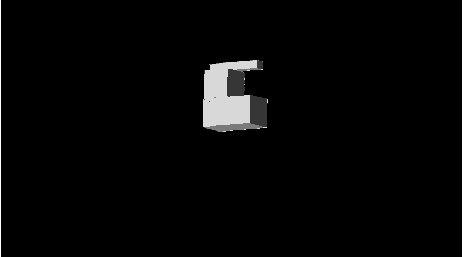
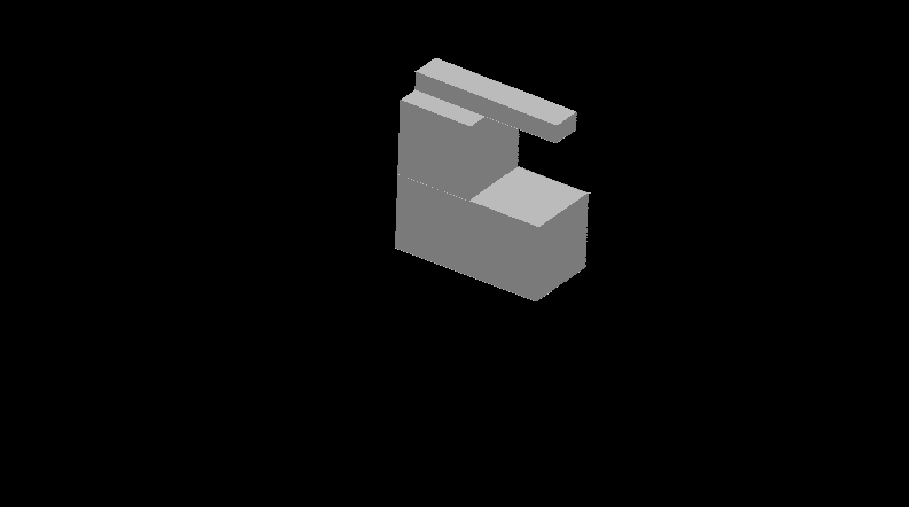
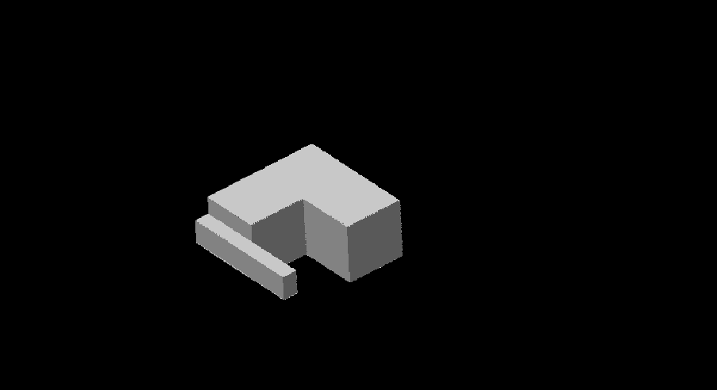
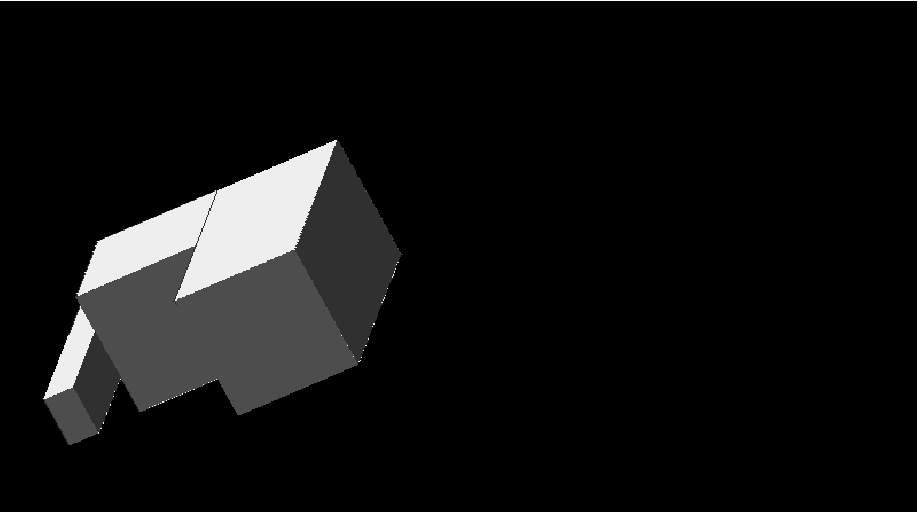

# 3d graphic project made for computer science class

## Requirements:

* Show 3d graphic on 2d plane without using any of the known tool for drawing
* Enable shape movement, each time the shape moves draw the whole "scenery" once again
* Use ambient light source and point light source
* Use bitmap to present points on the plane
* Work on matrices (all transformations)

## Usage

* After running application it's ready to use
* You can move the shape with keys
	* W and S to rotate on Y axis
	* A and D to rotate on Z axis
	* Z and C to rotate on X axis
	* Q and E to resize the shape 

## Screenshots

